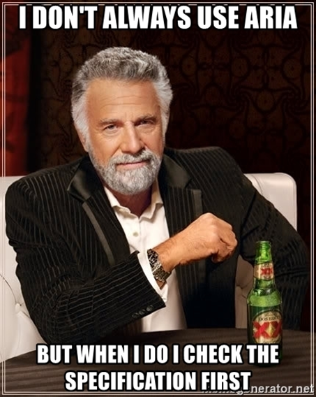

ARIA can be a source of confusion for many.  I think it's very important for developers to understand the basics of ARIA and where to go to find more information.  Here's my attempt at making ARIA easy to understand and implement.

## About ARIA
* ARIA is short for WAI-ARIA  which stands for Web Accessibility Initiative - Accessible Rich Internet Applications.
* WAI-ARIA is a specification that defines a way to make applications more accessible to people with disabilities.
* The first version, WAI-ARIA 1.0, was published as a completed W3C Recommendation in 2014.  [Read the current WAI-ARIA 1.2 specification](https://www.w3.org/TR/wai-aria-1.2/).
* ARIA attributes modify elements in the A11y Tree (they give additional semantics via "tree surgery").
* There are rules.  The first rule of ARIA is not to use ARIA (i.e., use semantic HTML if possible).  [Check out the rules and how to use ARIA](https://www.w3.org/TR/using-aria/).
* If you are implementing a custom component (not found in semantic HTML), follow the ARIA Authoring Practices for guidance. [WAI-ARIA Authoring Practices 1.2](https://www.w3.org/TR/wai-aria-practices-1.2/)

## Benefits of ARIA
ARIA is pretty powerful.  It can be used to:
1. Add and/or modify semantics of elements.
2. Create more User Interface (UI) patterns.
3. Add labels and descriptions.
4. Express relationships between elements (sort of).
5. Announce live updates.

### Add and/or Modify Semantics of Elements
As I mentioned in my [blog on semantic HTML](/blog/semanticHTML), each element gives meaning to the A11y Tree which is what assistive technology interacts with.  For example, if we had a form control with a label using semantic HTML such as:
````
<input type="checkbox" id="agree" name="agree" checked>
<label for="agree">I agree to the terms and conditions</label>
````

The visual UI and spoken UI (the information being sent to the assistive technology) would match.

<div style="margin-bottom: 2px;">Visual UI:</div>
<div style="margin-bottom: 20px;">
<input style="width: 20px; height: 20px; margin-right: 10px;" type="checkbox" id="agree" name="agree" checked />
<label for="agree">I agree to the terms and conditions</label>
</div>
Spoken UI:

"I agree to the terms and conditions, checkbox, checked"


<span role="img" aria-label="happy face with heart eyes" style='font-size:6rem; line-height:6rem'>&#128525;</span>

However, if we did not use semantic HTML and implemented the same visual UI with a styled ```<div>``` such as:

```
<div class="checkbox checked">I agree to the terms and conditions</div>
```

The visual UI and spoken UI would not match.

<div style="margin-bottom: 2px;">Visual UI:</div>
<div class="checkbox checked">I agree to the terms and conditions</div>

<div style="margin-bottom: 2px; margin-top: 30px;">Spoken UI:</div>

"I agree to the terms and conditions"

There is no notification that this element’s role is a checkbox and no notification of the state of the checkbox (checked or not checked). 

<span role="img" aria-label="sad face" style='font-size:6rem; line-height:6rem'>&#128543;</span>

In our checkbox example, we could add ARIA attributes to give meaning to the element.
Sprinkle in some ARIA:
```
<div role="checkbox" aria-checked="true" class="checkbox checked">
I agree to the terms and conditions
</div>
```
Role attributes are ARIA.  So by giving this ```<div>``` a role of checkbox and an aria-checked attribute of true, we now have the same meaning as if using semantic HTML.  

#### Warning About Using ARIA to Modify/Add Semantics

Don’t forget that semantic HTML also gives us focus and keyboard support by default.  So while this may give us the semantics we are looking for, it is useless because we don’t have focus or keyboard support.  ARIA only modifies the meaning, not the behavior!
Also, the second rule of ARIA is "Do not change native semantics, unless you really have to".   Adding an ARIA role to any element will override any native HTML semantics since ARIA always wins.

#### ARIA Attributes That Developers Should Know

Adding or modifying semantics with ARIA can be useful if done correctly.  A few examples of common, well-supported ARIA attributes that developers should know and use to modify/add semantics include:
* [role="search"](https://www.w3.org/TR/wai-aria/#search) can be added to a search form
* [aria-label](https://www.w3.org/TR/wai-aria/#aria-label) can be added to ```<nav>``` landmarks to distinguish them
* [aria-expanded](https://www.w3.org/TR/wai-aria/#aria-expanded) can be added to buttons that show/hide information
* [aria-describedby](https://www.w3.org/TR/wai-aria/#aria-describedby) can be added to add extra information to an input field
* [aria-current](https://www.w3.org/TR/wai-aria/#aria-current) can be added on a group of related links (such as a pagination)
* [aria-hidden](https://www.w3.org/TR/wai-aria/#aria-hidden) can be added on icons that have a parent with an accessible label

#### Warning About Role="Presentation" and Aria-Hidden="True" Attributes

The fourth rule of ARIA is "Do not use role="presentation" or aria-hidden="true" on a focusable element".  The ARIA [role="presentation"](https://www.w3.org/TR/using-aria/#presentation) (or role="none") removes the semantics from the element it is on and aria-hidden="true" hides the element from assistive technology.
Therefore, if we add one of these attributes to a focusable element (meaning it is in the Tab order), users will be confused as there is no meaningful information announced.

### Create More UI Patterns

HTML doesn’t give us all the design patterns we would like.  If you are creating a custom component, use the [ARIA Authoring Practices](https://www.w3.org/TR/wai-aria-practices-1.2/) as a guideline for how to add ARIA, implement focus, and add keyboard functionality.  The third rule of ARIA is "All interactive ARIA controls must be usable with the keyboard".  Make sure to read the Keyboard Interaction section in the ARIA Authoring Practices for a specific component to know what keyboard functionality is expected.

### Add Labels and Descriptions

The fifth rule of ARIA is "all interactive elements must have an accessible name".  If there is no visual label for an element, you can use aria-labelledby or aria-label to create one.
Be careful as ARIA always wins and if there is already a visual label programmatically associated with an element, that label will be overridden by the aria-label or aria-labelledby if provided.  This would be a violation of [WCAG Success Criterion 2.5.3 Label in Name](https://www.w3.org/WAI/WCAG21/Understanding/label-in-name.html), as the visual label must match the accessible label.  A good example for why this criterion is important would be a sighted user using voice to text will see the visual label, but when they use that label in a voice command, their assistive technology would not recognize the command as it only knows about the accessible label (assuming the visual and accessible label are completely different).  The attribute aria-describedby is used along with a label to add extra information.  The ARIA specification has a good [summary of support for aria-label, aria-labelledby, and aria-describedby](https://www.w3.org/TR/using-aria/#label-support).

### Express Relationships

Relationships between elements can be expressed with [aria-controls](https://www.w3.org/TR/wai-aria/#aria-controls) and [aria-owns](https://www.w3.org/TR/wai-aria/#aria-owns) (sort of).  [Léonie Watson summarizes the difference between the two attributes well](https://gitter.im/w3c/a11ySlackers?at=5655eb8a63bfb30b58e46529): "The difference between -owns and -controls is that -owns creates a parent/child relationship where none exists, and -controls indicates that one thing controls the other.
So A can control B, but A doesn't have to be a parent of B for that to be the case."
Further information on these attributes:

* [Aria-Controls is Poop - HeydonWorks](https://heydonworks.com/article/aria-controls-is-poop/)
* [Using the aria-owns attribute - Tink - Léonie Watson](https://tink.uk/using-the-aria-owns-attribute/)

I say these attributes express relationships "sort of" because neither of these have great support.  A great resource to check browser and screen reader support for ARIA attributes is at https://a11ysupport.io/.

### Announce Live Updates

The attributes of [aria-live="polite" or aria-live="assertive" create a "live" region](https://www.w3.org/TR/wai-aria-1.2/#aria-live), meaning when new text appears in the element containing one of these attributes, the assistive technology would be made aware of the updated text.  Live regions should be used sparingly.  They can be very disruptive to screen reader users, especially if the region has an aria-live value of "assertive".  A live region value of assertive means the user will be interrupted by the announcement as soon as it appears.
There are two very important use cases of live regions.  
1. Using [role="alert"](https://www.w3.org/TR/wai-aria-1.2/#alert) (this has an implicit aria-live value of assertive) is important for announcing an error message for a form.
[Learn how to use role="alert" to notify users of errors upon form submission](https://www.w3.org/WAI/WCAG21/Techniques/aria/ARIA19).
2. Using [role="status"](https://www.w3.org/TR/wai-aria-1.2/#status) (this has an implicit aria-live value of polite) for status updates, such as a successful form submission.
[Learn how to use role="status" to present status messages](https://www.w3.org/WAI/WCAG21/Techniques/aria/ARIA22).

## Summary

It is important to keep in mind that ARIA can add/modify (and override) semantics, but it cannot modify expected behavior (not without a lot of extra code)!  Developers should always use native HTML5 elements or attributes if they can.  Only include ARIA attributes used according to the ARIA specification and when necessary.  Utilize role=“status” for status updates and role=“alert” for error messages.  Lastly, follow the [ARIA Authoring Practices](https://www.w3.org/TR/wai-aria-practices-1.2/) when creating custom components. 

ARIA can be very powerful.  With great power comes great responsibility.  Always check the [ARIA specification](https://www.w3.org/TR/wai-aria-1.2/) when including ARIA in your code.



## Resources
* [WAI-ARIA Overview](https://www.w3.org/WAI/standards-guidelines/aria/)
* [Accessible Rich Internet Applications (WAI-ARIA) 1.2](https://www.w3.org/TR/wai-aria-1.2/)
* [Using ARIA](https://www.w3.org/TR/using-aria/)
* [a11ysupport.io - Accessibility Support data for various HTML, ARIA, CSS, and SVG features](https://a11ysupport.io/)
* [WAI-ARIA Authoring Practices 1.2](https://www.w3.org/TR/wai-aria-practices-1.2/)
* [Intro to ARIA -- A11ycasts #13](https://www.youtube.com/watch?v=g9Qff0b-lHk)

